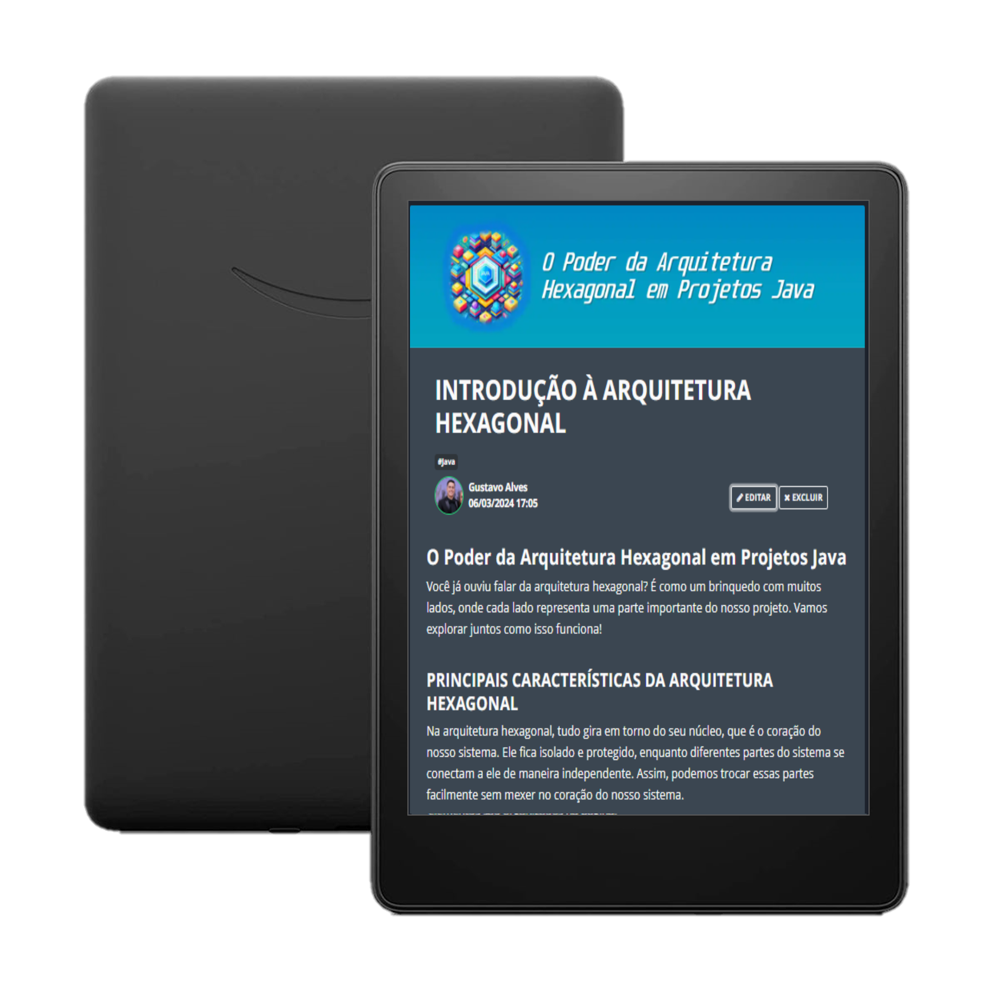

<a href="https://www.linkedin.com/in/gustavo-calves/">
    

<a href="https://github.com/gucabal?tab=repositories">
    

-------

# Projeto artigo técnico gerado por I.A.s

Projeto com o objetivo de gerar um artigo técnico com um layout rico, leitura agradável e com foco em promover sua autoridade técnica.

<a href="https://web.dio.me/articles/introducao-a-arquitetura-hexagonal?back=%2Farticles&open-modal=true&page=1&order=oldest" title="View PDF now"> 📕Clique aqui para ler o artigo</a>

## 💻 Tecnologias utilizadas no projeto

- [ChatGPT](https://chat.openai.com/) - para título e conteúdo
- [Bing Copilot](https://www.bing.com/chat) - para gerar imagens
- [PowerPoint](https://www.microsoft.com/en/microsoft-365/powerpoint) - Para formatação de banners e Layouts

## 📄 Prompts e ferramentas

ChatGPT：

|   Ação   | prompt                                                                                                                                                                                                                                                                         |
| :------: | ------------------------------------------------------------------------------------------------------------------------------------------------------------------------------------------------------------------------------------------------------------------------------ |
|  título  | Crie 10 headlines para nomes de artigos sobre o assunto Arquitetura Hexagonal com java                                                                                                                                                                                                    |
| conteúdo | Comporte-se como um escritor de artigos tech back-end e escreva o artigo atendendo as regras abaixo {REGRAS} 1- No maximo 5 linhas por paragrafo 2- Me expliquue de maneira simples como se eu fosse uma criança 3- Os blocos que serão criados estão abaixo: -Introdução à arquitetura hexagonal -Principais características da arquitetura hexagonal -Benefícios da arquitetura hexagonal em projetos Java -Componentes da arquitetura hexagonal -Implementação prática em projetos Java -Desafios e considerações -Conclusão |

## ✨ Features

- Conteúdo gerado via ChatGPT
- Imagens geradas via Bing

## 📚 Materiais

- prompts utilizados

## 🛠️ Instruções de execução

Utilize os prompts acima nas ferramentas sugeridas para gerar o material base e utilize uma ferramenta de edição de documentos como power point, libreoffice , indesign para diagramação.

